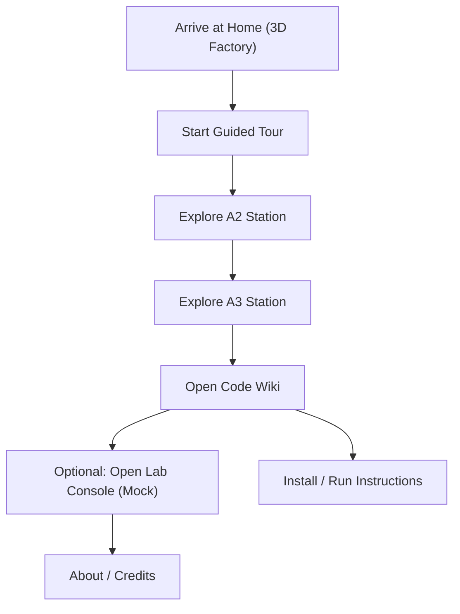

## 1. Product Overview
Create a high-end, 3D, “factory world” website that makes the DigiSteel-YOLO repository feel like a tangible industrial product.
- Primary purpose: turn the repo (A2/A3 innovations + wiki) into an immersive, memorable experience that reinforces the brand and makes the project feel unique
- Target users: reviewers/supervisors, recruiters, collaborators, and contributors who want to understand the project fast and remember it

## 2. Core Features

### 2.1 Feature Modules
1. **Factory World (Home)**: interactive 3D scene, guided camera tour, clickable “machines” as navigation
2. **Innovation Bay (A2/A3)**: interactive explanations of A2 GhostConv and A3 Inner-WIoU (visual + code-linked)
3. **Code Wiki**: render the existing markdown wiki as a first-class in-site documentation experience
4. **Lab Console (Mock)**: a cinematic “control room” dashboard with mock runs/results to preview future capabilities
5. **About / Credits**: team, supervisor, citations, license, links

### 2.2 Page Details
| Page Name | Module Name | Feature description |
|-----------|-------------|---------------------|
| Home | 3D Scene + Nav | Factory floor scene; hover highlights; click machines to open sections; mini-map + breadcrumbs; “Guided Tour” mode |
| Home | Hero Narrative | Short, sharp copy; “Start Tour” primary CTA; “Open Wiki” secondary; contextual microcopy |
| Innovation Bay | A2 Station | Animated ghost-feature generation concept; parameter reduction counter; toggle “shared vs unshared” visualization |
| Innovation Bay | A3 Station | Loss curve concept; interactive lambda slider; show how Inner/WIoU terms combine (mock plots) |
| Code Wiki | Markdown Reader | Render markdown from `/wiki/*.md`; left nav (pages), right “On this page”, code-reference deep links |
| Lab Console | Run Cards (Mock) | Run list, status, key metrics, export artifacts (all from mock JSON) |
| Lab Console | Robustness Grid (Mock) | 4×3 perturbation grid visualization; hover reveals severity definition; downloadable mock CSV |
| About | Team & Credits | Team members, supervisor, project context; links to README/GitHub |

## 3. Core Process
Primary flow: visitor lands in the factory → starts guided tour → explores A2/A3 → opens wiki → optionally checks “Lab Console” mock dashboard → exits with clear install/run instructions.

## 4. User Interface Design

### 4.1 Design Style
- Aesthetic direction: **industrial cinematic** (steel, graphite, oil-slick sheen, hazard accents, subtle grime, precision typography)
- Color strategy: committed dark neutrals + high-chroma accents
  - Base: near-black graphite (tinted, not pure #000)
  - Accent 1: molten amber / hazard stripe (status + CTA)
  - Accent 2: cold cyan (interactive focus + data glow)
  - Utility: muted reds/greens for status (kept low-chroma)
- Typography:
  - Distinctive display face for big headings (industrial/technical character)
  - Clean body face with high readability (65–75ch max line length)
  - Monospace only for short code tokens (never for paragraphs)
- Interaction principles:
  - Hover = intent preview, click = commit; always reversible navigation
  - Motion conveys state (selection, focus, loading, teleport) rather than decoration
  - Respect `prefers-reduced-motion`
- “Impeccable-style” guardrails:
  - Avoid purple gradients, nested cards, template hero layouts, overused default fonts, background-clip gradient text, thick side-tab cards

### 4.2 Page Design Overview
| Page Name | Module Name | UI Elements |
|-----------|-------------|-------------|
| Home | 3D Factory | Fog, volumetric light feel (postprocessing), emissive signage, subtle particles, click hotspots, cinematic transitions |
| Innovation Bay | Stations | Split layout: 3D/visual left, explanation right; interactive sliders/toggles; code snippet deep links |
| Code Wiki | Reader | Left nav, content column, right TOC; search; inline “open in repo” links |
| Lab Console | Dashboard | Control-room panels, status lights, waveform-like separators, data glow, keyboard shortcuts |

### 4.3 Responsiveness
- Desktop-first, but fully responsive
- Mobile: switch to “2.5D” mode (reduced scene complexity, larger touch targets, simplified camera movement)
- Touch: tap-to-focus + second tap-to-activate for 3D objects

### 4.4 3D Scene Guidance
- Environment mood: nighttime factory interior, low haze, crisp highlights, subtle bloom
- Lighting: 1 key overhead industrial light + rim lights + emissive signage; limit dynamic lights for performance
- Camera:
  - Default orbit constraints for casual users
  - Guided tour uses rail-based camera path with chapter stops (A2, A3, Wiki, Lab)
- Interactions:
  - Hover highlight via outline/postprocess or emissive ramp
  - Click triggers: camera move + section overlay
  - Mini-map for quick teleport
- Performance budgets:
  - Target 60fps on typical laptops
  - Prefer procedural meshes + instancing; avoid large external GLTF assets in v1

