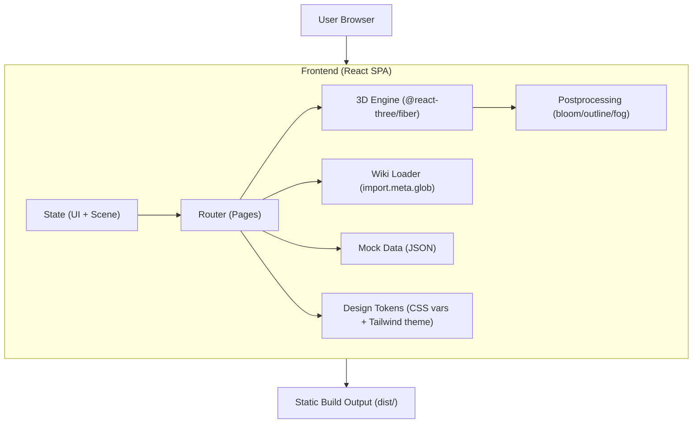

## 1. Architecture Design



Notes:
- No backend for v1; mock data ships with the frontend bundle.
- The existing Python package (`digisteel/`) remains unchanged; the frontend is a separate folder in the same repo.

## 2. Technology Description

- Frontend: React@18 + TypeScript + Vite
- Styling: TailwindCSS@3 (customized with CSS variables + theme tokens; avoid “default Tailwind look”)
- 3D: three + @react-three/fiber + @react-three/drei
- Effects: @react-three/postprocessing (bloom/outline), lightweight custom shaders if needed
- Markdown: render wiki via `import.meta.glob` + markdown renderer (e.g., `react-markdown`)
- Optional (if needed later): Zustand for state, Fuse.js for search

## 3. Route Definitions

| Route | Purpose |
|-------|---------|
| / | Home: 3D factory world + guided tour |
| /innovations | A2/A3 interactive stations |
| /wiki/:page | Wiki reader for markdown pages from `/wiki` |
| /lab | Control-room dashboard (mock runs/results) |
| /about | Team, credits, links |

## 4. Data Strategy (Mock First)

- Ship `src/data/mock/` JSON describing:
  - Runs list, statuses, metrics
  - Robustness sweep grid values (placeholder)
  - Export artifacts (placeholder)
- Keep shapes stable so later replacement with “real runs/evals parsing” or a backend API is non-breaking.

## 5. Frontend Folder Structure (Proposed)

```
frontend/
  index.html
  package.json
  vite.config.ts
  src/
    app/
      routes.tsx
      App.tsx
    pages/
      Home/
      Innovations/
      Wiki/
      Lab/
      About/
    scene/
      FactoryWorld.tsx
      stations/
        A2Station.tsx
        A3Station.tsx
      materials/
      post/
    ui/
      components/
      typography/
    data/
      mock/
    styles/
      tokens.css
      globals.css
```

## 6. Integration with Existing Repo Content

- Wiki content source: `/wiki/*.md` (already present in repo)
  - Build-time import via Vite glob (fast, no server required)
  - Preserve “open in repo” file links (link back to `file:///workspace/...` during dev; configurable for GitHub URLs later)
- Brand assets: `/assets/logo.png`, `/assets/banner.png`
- “Install / Run” content: pull key steps from README and Running wiki page, present as an in-site panel

