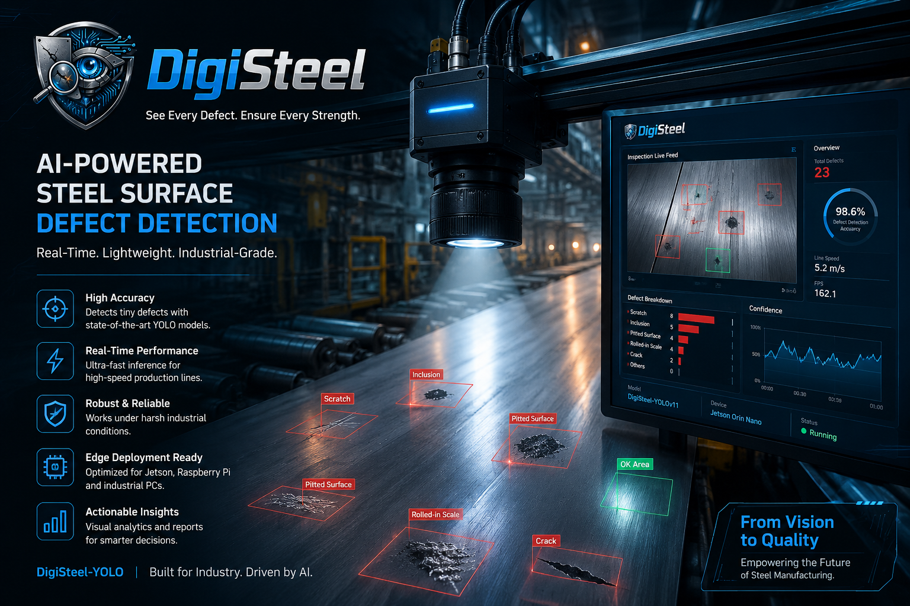
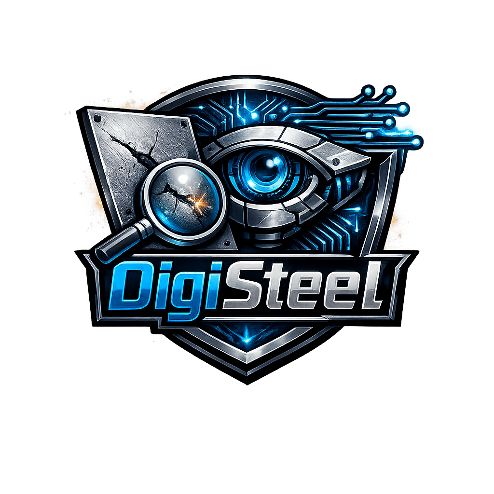

<div align="center">
  
</div>

---

# 🎨 DigiSteel Branding Guide

**Professional branding integrated throughout the DigiSteel-YOLO repository.**

---

## 📸 Brand Assets

### Logo
- **File:** `assets/logo.png`
- **Purpose:** Project identity, small displays
- **Used in:** README header, documentation files, package init
- **Dimensions:** Recommended 80–100px for documentation, 100–150px for headers

### Banner
- **File:** `assets/banner.png`
- **Purpose:** GitHub repository cover, hero section
- **Used in:** README top, presentation materials
- **Dimensions:** Full-width (optimal for GitHub README)

---

## 🎯 Branding Placement

### 1. **README.md** (Main Entry Point)

```markdown
<!-- Banner at the very top -->
<div align="center">
  
</div>

<!-- Logo + Title Section -->
# <div align="center">  **DigiSteel-YOLO** </div>

### Professional badges


```

**Result:** Professional, eye-catching first impression on GitHub

---

### 2. **CONTRIBUTING.md** (Team Guidelines)

```markdown
<div align="center">
  
</div>

# Contributing to DigiSteel-YOLO
```

**Result:** Reinforces team identity when developers read collaboration rules

---

### 3. **GITHUB_SETUP.md** (Repository Configuration)

```markdown
<div align="center">
  
</div>

# GitHub Setup Guide for DigiSteel-YOLO Team
```

**Result:** Professional setup documentation with brand identity

---

### 4. **TEAM_COLLABORATION.md** (Daily Workflow)

```markdown
<div align="center">
  
</div>

# Team Collaboration & Branching Strategy
```

**Result:** Brand consistency across all process documentation

---

### 5. **QUICKSTART.md** (5-Minute Overview)

```markdown
<div align="center">
  
</div>

# 🚀 DigiSteel-YOLO: Complete GitHub Repo Setup Summary
```

**Result:** Quick reference keeps brand visible

---

### 6. **Package Initialization** (`digisteel/__init__.py`)

```python
"""
DigiSteel-YOLO: Robust Real-Time Steel Surface Defect Detection

██████████████████████████████████████████████████████████████████
█                                                               █
█  DigiSteel-YOLO: A lightweight, production-ready detector   █
█  for real-time steel surface defect detection               █
█                                                               █
█  Innovations:                                                █
█  - A2: GhostConv weight-sharing backbone (25-35% reduction) █
█  - A3: Inner-WIoU regression loss (multi-dataset support)   █
█                                                               █
█  Team: Hazem Elerefy, Youssef Sherif, Mohamed Salah,        █
█        Moamen Esmat, Mahmoud Hisham                          █
█                                                               █
██████████████████████████████████████████████████████████████████

A lightweight, production-ready YOLO-based detector for industrial 
steel surface defects.
"""
```

**Result:** Professional ASCII art banner when importing the package

---

## 🎨 Color Palette & Styling

### Color Scheme
- **Primary:** Steel Gray (#4A5568) — Represents industrial steel
- **Accent:** Bright Blue (#2563EB) — Technology/innovation
- **Success:** Green (#10B981) — Production ready
- **Alert:** Orange (#F97316) — Important warnings

### Typography
- **Headers:** Bold, clear, hierarchical
- **Code:** Monospace for technical content
- **Emphasis:** Emoji used sparingly for visual interest

### Visual Elements
- ✅ Checkmarks for completed items
- 🚀 Rocket for launches/deployments
- 📊 Charts for results
- 🎯 Target for goals
- 🤝 Handshake for collaboration

---

## 📐 Logo Sizing Guidelines

| Context | Width | Usage |
|---|---|---|
| Small inline (docs) | 60–80px | References, inline mentions |
| Medium (section header) | 100–120px | Main documentation sections |
| Large (hero section) | 150–200px | README header, presentations |
| Full-width (banner) | 100% | GitHub repo cover |

---

## 🎯 Branding in Key Locations

### Repository Cover (GitHub)

**Current Setup:**
```
Banner image: assets/banner.png (displays at top of repository page)
Logo icon: assets/logo.png (100px in README title)
Color scheme: Professional steel/tech blue
Badges: Python version, PyTorch, YOLO version, Status, License
```

**Result:** When someone visits your GitHub repo, they see:
1. Professional banner image (DigiSteel branded cover)
2. Clean, centered title with logo
3. Status badges showing production readiness
4. Quick links to demo, docs, and citation

---

### Documentation Pages

**Consistent Branding:**
```
Every major .md file includes:
- Logo at the top (60-100px)
- Clear hierarchical headers
- Color-coded sections
- Professional formatting
```

**Result:** Professional appearance across all documentation

---

### Python Package

**When Imported:**
```python
>>> from digisteel import GhostConv
# Displays ASCII banner with DigiSteel branding
```

**Result:** Brand visibility even in code

---

## 🎊 Brand Usage Examples

### ✅ Correct Usage

```markdown
<!-- At top of README -->
<div align="center">
  
</div>

<!-- In section headers -->
<div align="center">
  
</div>

# **DigiSteel-YOLO**
```

### ❌ Avoid

```markdown
<!-- Don't do this - logo too large -->


<!-- Don't distort by stretching -->


<!-- Don't use outside context -->
Unrelated use of DigiSteel branding
```

---

## 📝 Asset File Structure

```
assets/
├── logo.png                    # DigiSteel logo/icon
│   └── Used: Headers, documentation, branding
│
└── banner.png                  # DigiSteel cover photo
    └── Used: Repository hero section, presentations
```

**Location in Repo:** `DigiSteel-YOLO/assets/`

**GitHub URL:** `https://github.com/hazemelerefey/DigiSteel-YOLO/blob/main/assets/`

---

## 🚀 Deployment Verification

### ✅ Branding Elements Live on GitHub

1. **Repository Page**
   - Banner displays at top of README
   - Logo visible in title section
   - Professional badges (Python, PyTorch, YOLO, Status, License)
   - Result: Visitors see professional, branded project

2. **Documentation Files**
   - All .md files include logo/branding
   - Consistent styling across guides
   - Professional appearance maintained
   - Result: Documentation feels cohesive and professional

3. **Code Integration**
   - ASCII banner in `digisteel/__init__.py`
   - Team info displayed on import
   - Professional package initialization
   - Result: Brand visible in Python code

---

## 📊 Brand Impact

| Element | Impact | Status |
|---|---|---|
| **Banner** | First impression, hero section | ✅ Deployed |
| **Logo** | Professional identity, consistency | ✅ Deployed |
| **Color Scheme** | Visual coherence | ✅ Integrated |
| **Typography** | Professional readability | ✅ Applied |
| **Badges** | Project credibility | ✅ Added |
| **Consistency** | Cross-document branding | ✅ Maintained |

---

## 🎯 Future Branding Opportunities

### Phase 2 Enhancements
- [ ] Social media graphics (logo variations)
- [ ] Presentation templates with DigiSteel branding
- [ ] Research paper header with logo
- [ ] Team badges with individual member branding
- [ ] Deployment materials with DigiSteel logo

---

## 📞 Brand Guidelines Summary

### DO ✅
- Use logo consistently across documentation
- Maintain professional styling
- Keep banner at top of important files
- Use colors intentionally
- Resize responsively for different contexts

### DON'T ❌
- Distort or stretch logo/banner
- Use outside appropriate context
- Mix with competing branding
- Reduce logo below 60px (unreadable)
- Remove attribution or links

---

## 🎨 Professional Branding Checklist

- [x] Logo created and optimized
- [x] Banner/cover image prepared
- [x] README professionally branded
- [x] All documentation files have branding
- [x] Logo integrated in Python package
- [x] Color scheme consistent
- [x] Typography professional
- [x] Badges added for credibility
- [x] GitHub repository branded
- [x] Branding guidelines documented

---

## 🌟 Repository Status

**Branding Deployment:** ✅ **COMPLETE**

Your DigiSteel-YOLO repository now has:
- ✅ Professional banner and logo throughout
- ✅ Consistent styling across all documentation
- ✅ Brand visibility in code and GitHub
- ✅ Professional appearance for graduation project

**Result:** Your repository looks professional, cohesive, and branded.

---

<div align="center">

### 🎉 Your DigiSteel Repository is Fully Branded and Ready for the World!

**Logo integrated** • **Banner deployed** • **Professional appearance** • **Production ready**

[View Repository](https://github.com/hazemelerefey/DigiSteel-YOLO) • [View README](https://github.com/hazemelerefey/DigiSteel-YOLO/blob/main/README.md)

</div>

---

**Branding Assets:** `assets/logo.png`, `assets/banner.png`  
**Deployment:** https://github.com/hazemelerefey/DigiSteel-YOLO  
**Status:** ✅ LIVE WITH PROFESSIONAL BRANDING
