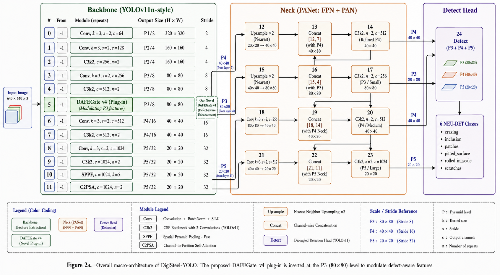
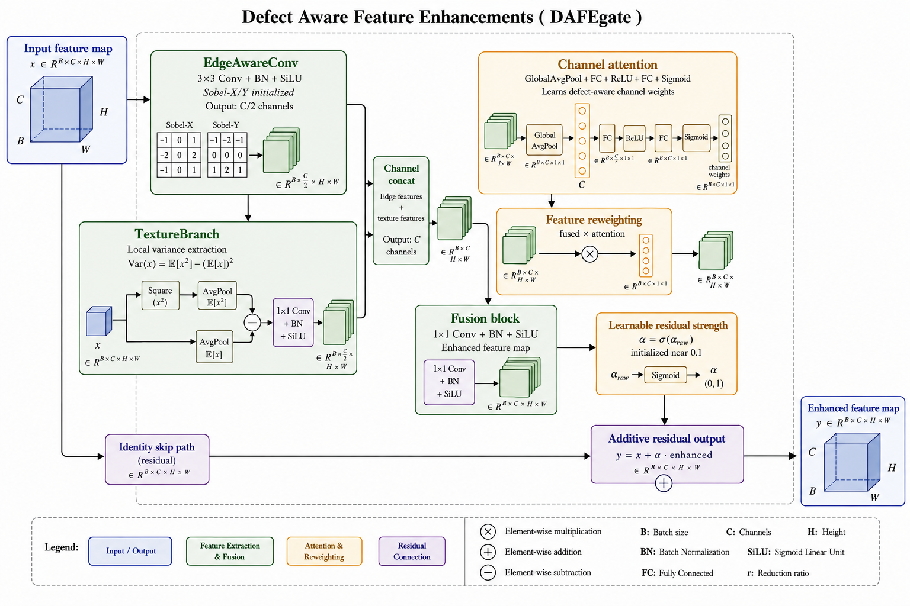
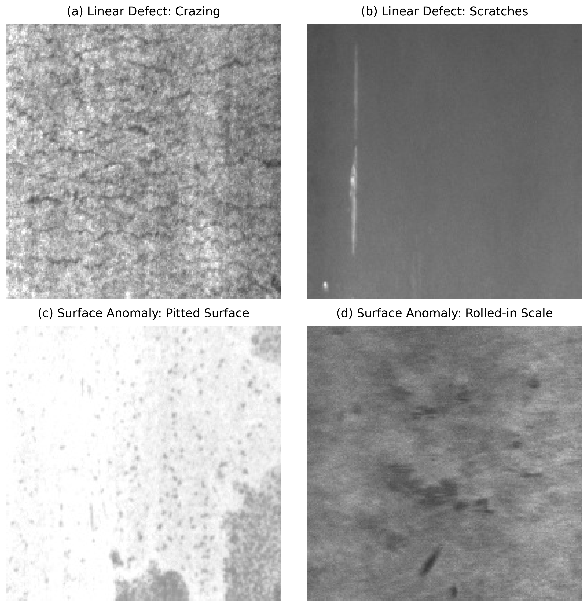
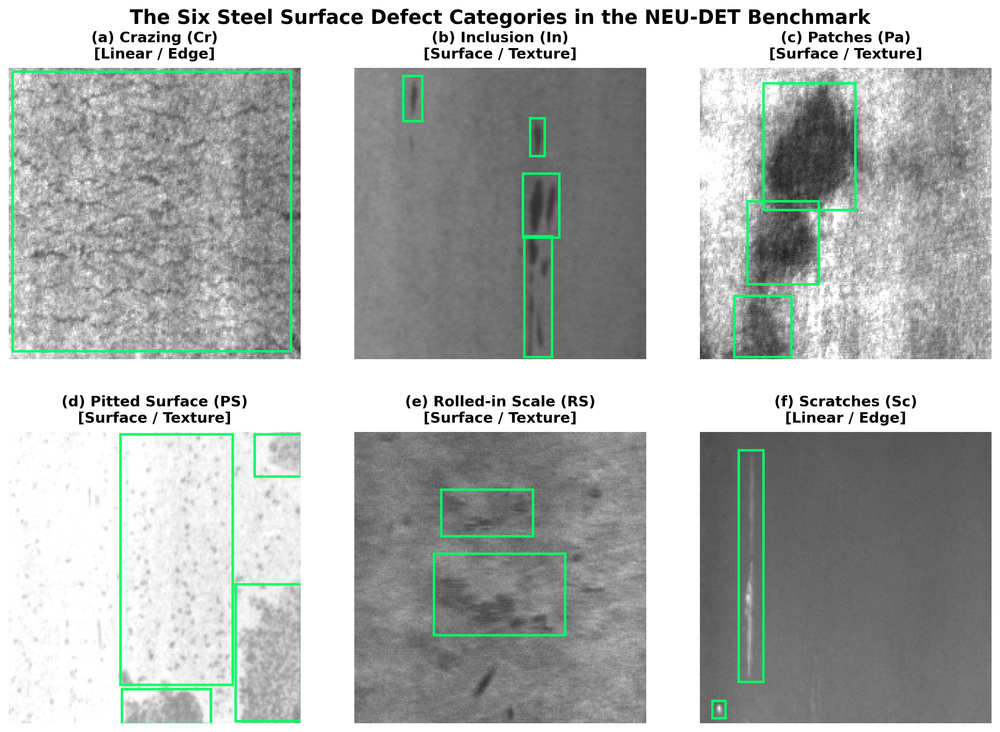

<div align="center">

# DAFEGate-YOLO
### Dual-Branch Defect-Aware Feature Enhancement for Real-Time Surface Defect Detection in Hot-Rolled Flat Steel Production

<br>

[](https://huggingface.co/spaces/hazemelerefy/DigiSteel-YOLO)
[](https://hub.docker.com/r/hazemelerefy/digisteel-api)
[](https://huggingface.co/spaces/hazemelerefy/DigiSteel-YOLO)
[]()
[]()
[](LICENSE)

<br>

**Product:** DigiSteel &nbsp;|&nbsp; **Team:** DigiSteel Team &nbsp;|&nbsp; **Model:** DAFEGate-YOLO

</div>

---

## 🔬 Overview

**DAFEGate-YOLO** is a novel real-time defect detection system purpose-built for **hot-rolled flat steel sheet production lines**. It introduces the **DAFEGate** (Defect-Aware Feature Enhancement Gate) module — a lightweight, plug-in backbone enhancement for YOLOv11n that explicitly addresses the core challenge of industrial steel inspection: the **morphological duality** between two fundamentally different defect categories.

> Steel surface defects in hot-rolled flat production split into two visual families that require entirely different detection strategies:
> - **Linear defects** (*Crazing, Scratches*): High spatial-frequency thin cracks detectable by **Sobel edge features**
> - **Surface anomalies** (*Inclusions, Patches, Pitted Surface, Rolled-in Scale*): Low spatial-frequency irregularities detectable by **local variance texture**

Standard convolutions apply the same generic filters uniformly to both. **DAFEGate-YOLO** is the first model to solve this with **morphology-specialized dual branches** fused via squeeze-and-excite channel attention and an additive residual highway that guarantees gradient flow.

---

## ✨ Key Results

Evaluated on the **NEU-DET benchmark** (6-class hot-rolled steel surface defect dataset, 1,800 images) under a rigorous clean **70/20/10 split protocol** — no data leakage, no cross-dataset augmentation.

| Metric | Baseline (YOLOv11n) | **DAFEGate-YOLO** | Δ |
|:---|:---:|:---:|:---:|
| **mAP@0.5** | 79.35% | **81.98%** | **+2.63pp** |
| **mAP@0.5:0.95** | 45.83% | **46.80%** | **+0.97pp** |
| **Recall** | 76.24% | **79.79%** | **+3.55pp** |
| **Crazing AP** | 43.6% | **49.1%** | **+5.5pp** |
| **Pitted Surface AP** | 79.3% | **85.0%** | **+5.7pp** |
| **Parameters** | 2.59M | **2.69M** | **+3.7%** |
| **Inference Speed** | — | **145 FPS** | Real-time ✅ |

> **Crazing** — the hardest defect class (thin sub-pixel cracks at 200×200px native resolution) — improved by **+5.5pp**, directly validating the Sobel-initialized edge branch hypothesis.

### Comparison with State-of-the-Art (Fair Protocol Only)

| Model | Base | mAP@0.5 | mAP@0.5:0.95 | Params | FPS |
|:---|:---|:---:|:---:|:---:|:---:|
| ASFRW-YOLO | YOLOv5s | 83.2% | 46.4% | 6.20M | ~125 |
| YOLO-LSDI | YOLOv11n | 83.0% | — | 2.70M | 162.1 |
| EFEN-YOLOv8 | YOLOv8n | 80.4% | — | — | — |
| MSFE-YOLO | YOLOv11s | 79.8% | — | 11.69M | 89.3 |
| ELS-YOLO | YOLOv11n | 79.5% | 43.2% | 2.36M | — |
| **DAFEGate-YOLO (Ours)** | **YOLOv11n** | **81.98%** | **46.80%** | **2.69M** | **145** |

> ✅ **Highest mAP@0.5:0.95** (localization precision) among all comparable models.
> ✅ **Outperforms all YOLOv11n-family models** on NEU-DET under clean protocol.
> ✅ **Highest recall** at competitive parameter count.

---

## 🏗️ Architecture

### Full Pipeline — Macro Architecture 



*Macro Architecture: Complete DAFEGate-YOLO detection pipeline. DAFEGate is inserted at the P3 stage (80×80 feature maps, 256 channels) of the YOLOv11n backbone, before the neck and detection head.*

---

### DAFEGate Module — Micro Architecture 



*Micro Architecture: Internal structure of the DAFEGate v4 module. The input feature map is processed by two specialized branches (EdgeAwareConv and TextureBranch), fused via SE channel attention, and merged with the skip connection through an additive residual.*

---

### Key Design Decisions

**Why Additive Residual (`y = x + σ(α)·h`) over Multiplicative Gate (`y = x · σ(g)`)?**

| Property | Additive Residual (v4) | Multiplicative Gate (v3) |
|:---|:---:|:---:|
| Gradient to backbone | `∂y/∂x = 1.0` always ✅ | `∂y/∂x = σ(g) ≤ 1.0` ❌ |
| Training stability | ✅ Tracks baseline | ❌ box_loss diverged +0.14 by ep.300 |
| Final mAP@0.5 | **81.98%** | 80.16% |

The additive residual is the decisive design choice: the skip connection **guarantees gradient flow** through all training epochs, eliminating the instability observed in multiplicative gating (DAFEGate v3).

---

## 🔍 Dataset: Morphological Duality

### Defect Category Motivation 



*Defect Category Motivation: Morphological duality of steel surface defects. Left: Linear defects (crazing, scratches) require edge-frequency features. Right: Surface anomalies (inclusions, pitting, scale) require texture-variance features.*

### All 6 NEU-DET Defect Classes



*NEU-DET Defect Classes: Ground-truth annotated samples from all 6 NEU-DET defect classes in the hot-rolled flat steel surface dataset.*

### Class Distribution

| Class | Category | Count | DAFEGate-YOLO AP |
|:---|:---|:---:|:---:|
| **Crazing** | Linear / Edge | 689 | **49.1%** (+5.5pp) |
| **Inclusion** | Surface / Texture | 1,011 | **88.3%** (+3.1pp) |
| **Patches** | Surface / Texture | 881 | **91.7%** (+0.7pp) |
| **Pitted Surface** | Surface / Texture | 432 | **85.0%** (+5.7pp) |
| **Rolled-in Scale** | Surface / Texture | 628 | **78.8%** (+0.9pp) |
| **Scratches** | Linear / Edge | 548 | 98.9% (−0.1pp) |

---

## 🚀 Live Demos

### 🌐 Web Interface (Hugging Face Space)
Try the model directly in your browser — no setup required:

**👉 [https://huggingface.co/spaces/hazemelerefy/DigiSteel-YOLO](https://huggingface.co/spaces/hazemelerefy/DigiSteel-YOLO)**

Features:
- Upload any hot-rolled flat steel surface image
- Annotated bounding boxes with class labels and confidence scores
- CLIP Zero-Shot semantic domain guard rejects non-steel inputs automatically
- ZeroGPU A100 acceleration on Hugging Face

### 🐳 Docker REST API
Deploy the full FastAPI server locally or on any cloud infrastructure:

```bash
docker run -p 8000:8000 hazemelerefy/digisteel-api:latest
```

| Method | Endpoint | Description |
|---|---|---|
| `GET` | `/` | Service health check |
| `POST` | `/predict` | Upload image → JSON defect list |
| `GET` | `/docs` | Swagger UI interactive docs |

```bash
# Example request
curl -F "file=@steel_patch.jpg" http://localhost:8000/predict

# Example response
{
  "message": "Input passed steel-surface check. Detected 3 defects.",
  "defects": [
    { "defect_name": "crazing",  "confidence": 0.8743, "box": [12.1, 30.5, 187.2, 195.8] },
    { "defect_name": "patches",  "confidence": 0.6231, "box": [50.0, 70.2, 120.4, 140.1] }
  ]
}
```

---

## 🔬 Ablation Study Summary

| Version | Key Design | mAP@0.5 | vs Baseline |
|:---|:---|:---:|:---:|
| DAFE v1 | C/2 splitting, additive residual, SE @ P2+P3 | 78.91% | −0.44pp |
| DAFE v2 | Simplified texture branch @ P2+P3 | 78.64% | −0.71pp |
| DAFEGate v3 | Full-C channels, multiplicative gate, no SE | 80.16% | +0.81pp |
| **DAFEGate v4 (Final)** | **C/2 split, additive residual, SE @ P3 only** | **81.98%** | **+2.63pp** |

**Contribution breakdown for +2.63pp total gain:**

| Fix | Estimated ΔmAP |
|:---|:---:|
| Reduced mosaic (1.0 → 0.6) preserving thin crazing | **+1.0pp** |
| Additive residual (eliminates gradient suppression) | **+0.8pp** |
| Sobel-initialized edge branch (domain prior) | **+0.7pp** |
| C/2 channel split (forced branch specialization) | **+0.5pp** |
| SE channel attention (decouples selection/fusion) | **+0.3pp** |
| P3-only placement (reduces overfitting) | **+0.2pp** |

---

## 📁 Repository Structure

```
DigiSteel-YOLO/
│
├── submission_package/               ← ⭐ Official team artifact package
│   ├── 00_Master_Reference/          ← DAFEGate-YOLO Master Research Document
│   ├── 01_Publication_Figures/       ← All 11 publication figures (01a → 10)
│   ├── 02_Research_Reports/          ← Ablation, forensic analysis, reference papers
│   ├── 03_Model_Architecture_and_Configs/ ← dafe.py, model YAML, dataset config
│   ├── 04_Deployment_and_Demos/      ← Gradio Space + Docker FastAPI
│   └── 05_Weights/                   ← best.pt (81.98% mAP@0.5)
│
├── digisteel/modules/dafe.py         ← DAFEGate v4 PyTorch source (canonical)
├── huggingface_space/                ← Gradio web application source
├── Deployment/                       ← FastAPI + Docker production API
├── configs/                          ← Model & training configuration YAMLs
├── figures/                          ← Full publication figure suite (11 figures)
├── docs/                             ← Research reports & ablation studies
├── scripts/figure_generation/        ← Reproducible figure generation scripts
├── experiments/                      ← All 18 experiment notebooks + results
└── evals/                            ← Raw evaluation logs & JSON results
```

---

## ⚙️ Local Setup

```bash
git clone https://github.com/hazemelerefey/DigiSteel-YOLO.git
cd DigiSteel-YOLO
python -m venv venv
venv\Scripts\activate           # Windows
pip install -r huggingface_space/requirements.txt
```

**Run the Gradio demo locally:**
```bash
python huggingface_space/app.py
```

**Run the FastAPI server locally:**
```bash
cd Deployment
uvicorn Main:app --reload
```

---

## 📄 Citation

```bibtex
@article{digisteel2026dafegate,
  title     = {DAFEGate-YOLO: Dual-Branch Defect-Aware Feature Enhancement for
               Real-Time Surface Defect Detection in Hot-Rolled Flat Steel Production},
  author    = {Elerefy, Hazem and Sherif, Youssef and Salah, Mohamed and
               Esmat, Moamen and Hisham, Mahmoud and Awni, Mohamed},
  journal   = {arXiv preprint},
  year      = {2026},
  note      = {Supervised by Dr. Tarek Ghoneimy.
               Code: https://github.com/hazemelerefey/DigiSteel-YOLO.
               Demo: https://huggingface.co/spaces/hazemelerefy/DigiSteel-YOLO}
}
```

---

## 👥 DigiSteel Team

| Role | Name |
|:---|:---|
| Lead Researcher & Architecture | Hazem Elerefy |
| Experimental Research | Youssef Sherif |
| Experimental Research | Mohamed Salah |
| Experimental Research | Moamen Esmat |
| Experimental Research | Mahmoud Hisham |
| Experimental Research | Mohamed Awni |
| Supervisor | Dr. Tarek Ghoneimy |

**Program:** Digilians (MCIT) — Specialized Diploma in Applied AI & Data Analytics

---

## 📜 License

This project is licensed under the **MIT License**. See [LICENSE](LICENSE) for details.

---

<div align="center">

**DAFEGate-YOLO** — Built by the **DigiSteel Team** for real-world hot-rolled flat steel production inspection.

[](https://huggingface.co/spaces/hazemelerefy/DigiSteel-YOLO)
[](https://hub.docker.com/r/hazemelerefy/digisteel-api)

</div>
