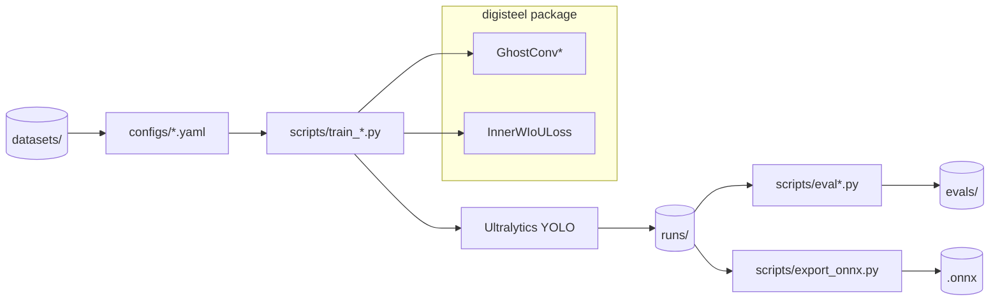

# Architecture

## Project Goal (Conceptual)

DigiSteel-YOLO aims to train and evaluate a lightweight YOLO-based detector for steel surface defects with two core modifications:

- **A2 (Backbone block): GhostConv + weight-sharing** — implemented in [ghost_conv.py](file:///workspace/digisteel/modules/ghost_conv.py)
- **A3 (Loss): Inner-WIoU regression loss** — implemented in [inner_wiou.py](file:///workspace/digisteel/modules/inner_wiou.py)

The repository currently contains the reusable building blocks for A2/A3 and scaffolding (configs/tests). Full training/evaluation scripts are described in docs but not included in this snapshot.

## Runtime Architecture (Current Snapshot)

### Library Layer (`digisteel`)

- **Public entrypoint:** [digisteel/__init__.py](file:///workspace/digisteel/__init__.py)
  - Re-exports `GhostConv` and `InnerWIoULoss` for downstream integration.
- **Modules:** [digisteel/modules/](file:///workspace/digisteel/modules)
  - A2: `GhostModule`, `GhostConv`, `GhostConvWeightSharing`
  - A3: `iou`, `inner_iou_loss`, `wiou_v3_loss`, `InnerWIoULoss`
- **Planned namespaces (currently stubs):**
  - [digisteel/data](file:///workspace/digisteel/data) (dataset loaders)
  - [digisteel/perturbations](file:///workspace/digisteel/perturbations) (robustness perturbations)
  - [digisteel/eval](file:///workspace/digisteel/eval) (evaluation utilities)
  - [digisteel/export](file:///workspace/digisteel/export) (model export helpers)

### Config Layer (`configs/`)

The YAML files in [configs/](file:///workspace/configs) are Ultralytics-style *dataset* configs (paths + class names). They include notes stating that A2/A3 are applied via Python patching in training scripts (see e.g. [yolov11n_a2_a3.yaml](file:///workspace/configs/yolov11n_a2_a3.yaml)).

### Test Layer (`tests/`)

Pytest unit tests validate:

- A2 module shapes, stride behavior, and gradient flow ([test_ghost_conv.py](file:///workspace/tests/test_ghost_conv.py))
- A3 loss behavior and gradient flow ([test_inner_wiou.py](file:///workspace/tests/test_inner_wiou.py))

## Intended Training/Evaluation Flow (As Described by Docs)

The repository documentation describes a target structure where external “workflow scripts” drive training/evaluation, while `digisteel` provides reusable blocks.

Notes:

- The `scripts/` and `tools/` directories referenced in [README.md](file:///workspace/README.md) and [PROJECT_GUIDE.md](file:///workspace/PROJECT_GUIDE.md) are not present in this snapshot; the diagram reflects the documented intent, not current on-disk code.
- Dataset paths in configs assume a local `datasets/` directory (example: [yolov11n_baseline.yaml](file:///workspace/configs/yolov11n_baseline.yaml)).

