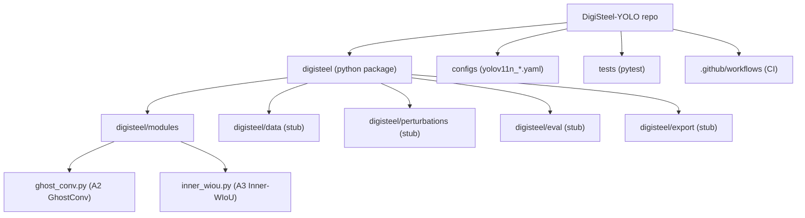
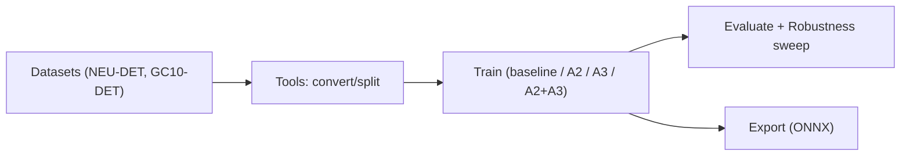

# Architecture

## High-Level View

The repository is structured as a Python package (`digisteel`) plus configuration and testing assets around it.

- **Library layer:** `digisteel/` contains reusable code (A2/A3 and planned future modules).
- **Configuration layer:** `configs/` contains experiment config YAMLs.
- **Quality layer:** `tests/` validates core primitives and ensures imports work in CI.
- **Automation layer:** `.github/workflows/` runs ruff, black, and pytest on PRs/pushes.

## Current Architecture (What Exists Today)

## Intended Training/Evaluation Flow (Documented, Not Yet Implemented Here)

The README describes a pipeline with scripts and tools (download datasets, convert formats, train variants, evaluate robustness, export ONNX). In this snapshot, those scripts are missing, but the directory placeholders are reflected in documentation like [00_START_HERE.md](../00_START_HERE.md).

Intended flow, based on README and configs:

## Key Design Decisions

### A2: Weight Sharing as a First-Class Primitive

- A2 is explicitly implemented as `GhostConvWeightSharing`, which wraps a single `GhostModule` and reuses it across multiple feature maps.
- This is meant to be “wiring-level” logic: the caller controls which pyramid stage features reuse the same module instance.

### A3: Loss Implemented as Standalone Torch Module

- A3 is encapsulated in `InnerWIoULoss`, with helper functions (`iou`, `inner_iou_loss`, `wiou_v3_loss`) that operate on `[x1, y1, x2, y2]` formatted tensors.
- This makes A3 easy to integrate into other training code without coupling to a specific detector implementation.

## Entry Points

- Package exports: [digisteel/__init__.py](../digisteel/__init__.py)
  - `GhostConv`
  - `InnerWIoULoss`

For deeper details, see:

- [Modules](Modules.md)
- [API](API.md)
