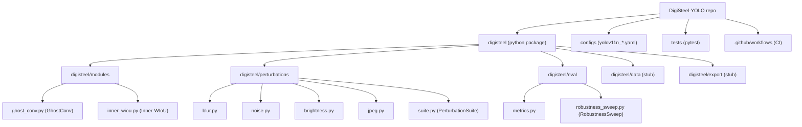
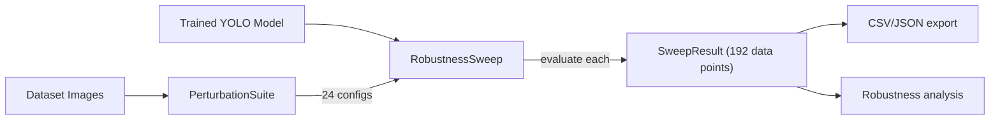
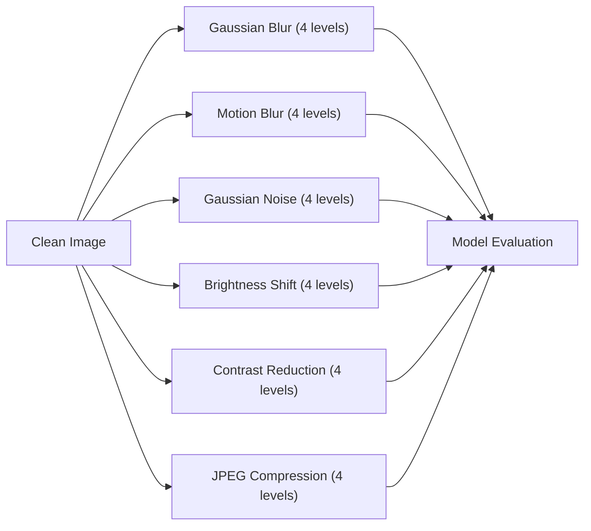

# Architecture

## High-Level View

The repository is structured as a Python package (`digisteel`) plus configuration and testing assets around it.

- **Library layer:** `digisteel/` contains reusable code (modules, perturbations, evaluation).
- **Configuration layer:** `configs/` contains experiment config YAMLs.
- **Quality layer:** `tests/` validates core primitives and ensures imports work in CI.
- **Automation layer:** `.github/workflows/` runs ruff, black, and pytest on PRs/pushes.

## Current Architecture (What Exists Today)

## Robustness Evaluation Flow (Core Contribution)

The primary workflow is the robustness evaluation pipeline:

### Perturbation Pipeline

## Key Design Decisions

### Modules: Proven Techniques, Not Novel Claims

- `GhostConv` implements the Ghost convolution from Han et al. (CVPR 2020). It is a proven lightweight convolution technique, not our invention.
- `InnerWIoULoss` combines Inner-IoU (Zhang 2023) and WIoU v3 (Tong 2023). It is a principled combination of existing losses, not our invention.
- **The weight-sharing variant (GhostConvWeightSharing) was removed** because sharing weights across pyramid stages (P3/P4/P5) is architecturally unsound — different scales need different feature extractors.

### Perturbations: The Core Contribution

- `PerturbationSuite` provides a unified interface for 6 perturbation types x 4 severity levels.
- Each perturbation simulates a real-world industrial image degradation.
- The suite is designed for reproducibility (seeded noise, deterministic transforms).

### Evaluation: Standardized and Reproducible

- `RobustnessSweep` runs the full evaluation pipeline (24 configs per model per dataset).
- Results are exported as CSV/JSON with 8 metrics per evaluation point.
- The framework supports any YOLO model loaded via Ultralytics.

## Entry Points

- Package exports: [digisteel/__init__.py](../digisteel/__init__.py)
  - `GhostConv`, `GhostModule`
  - `InnerWIoULoss`, `inner_iou_loss`, `wiou_v3_loss`
- Perturbation toolkit: [digisteel/perturbations/__init__.py](../digisteel/perturbations/__init__.py)
  - `PerturbationSuite`, `GaussianBlur`, `MotionBlur`, `GaussianNoise`, `BrightnessShift`, `ContrastReduction`, `JPEGCompression`
- Evaluation framework: [digisteel/eval/__init__.py](../digisteel/eval/__init__.py)
  - `RobustnessSweep`, `compute_metrics`

For deeper details, see:

- [Modules](Modules.md)
- [API](API.md)
