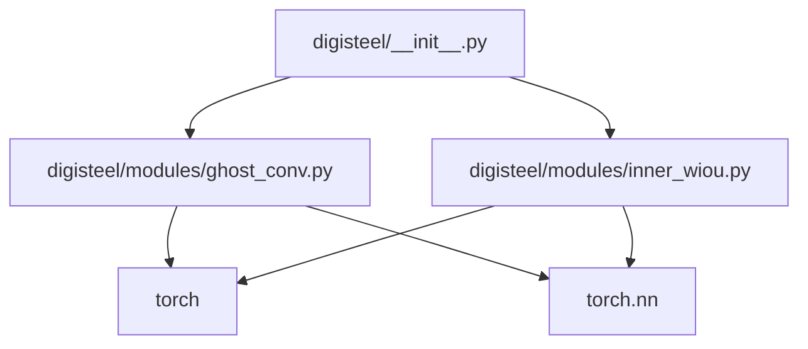

# Dependencies

## Python Packaging

Package metadata and install configuration live in:

- [pyproject.toml](../pyproject.toml)

Install mode:

- Editable install is supported (`pip install -e .`)
- Dev dependencies are defined as an extra (`pip install -e .[dev]`)

## External Runtime Dependencies (Core)

From [requirements.txt](../requirements.txt) / `pyproject.toml`:

- `torch`, `torchvision`: model primitives and tensor ops
- `ultralytics`: YOLO framework integration target
- `albumentations`, `opencv-python`, `pillow`: image augmentation and I/O
- `numpy`, `pandas`: numeric/data utilities
- `pyyaml`: config parsing
- `matplotlib`, `seaborn`: plotting/reporting utilities
- `scikit-learn`: metrics utilities
- `onnx`, `onnxruntime`: export and inference
- `tensorboard`: experiment logging

## Dev / Quality Tooling

- `pytest`, `pytest-cov`: tests and coverage
- `ruff`: linting
- `black`: formatting
- `flake8`, `mypy`: additional lint/type tooling

## Internal Dependency Graph

Notes:

- In the current snapshot, `digisteel/data`, `digisteel/eval`, `digisteel/export`, `digisteel/perturbations` do not define additional dependencies beyond Python itself (they are stubs).
- The heavy dependencies (ultralytics, opencv, albumentations) are listed for the full intended project, but not all are exercised by unit tests that exist today.

## Platform Notes

The dependencies are typical for a PyTorch + CV stack:

- CPU-only installs should work (slower).
- CUDA installs require matching versions of `torch` and system CUDA drivers.

For the repo’s supported Python versions and tooling configuration, see:

- [pyproject.toml](../pyproject.toml)
