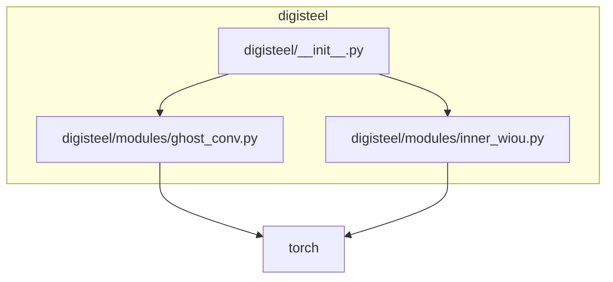

# Dependencies

## Runtime Requirements

- **Python:** `>=3.10` ([pyproject.toml](file:///workspace/pyproject.toml#L5-L11))
- **Core runtime deps (selected):**
  - `torch`, `torchvision` (A2/A3 modules depend on PyTorch)
  - `ultralytics` (intended training/inference framework per docs)
  - `albumentations`, `opencv-python` (intended perturbations/tooling per docs)
  - `onnx`, `onnxruntime` (intended export/deployment per docs)
  - See full list in [pyproject.toml](file:///workspace/pyproject.toml#L31-L48) or [requirements.txt](file:///workspace/requirements.txt).

## Development Dependencies

Defined as `project.optional-dependencies.dev` in [pyproject.toml](file:///workspace/pyproject.toml#L50-L59) and used by the setup script and CI:

- `pytest`, `pytest-cov`
- `black`, `ruff` (plus `flake8`, `mypy`)

## Internal Dependencies (Code-Level)

The current code-level internal dependency graph is shallow:

## CI Dependency Expectations

CI is defined in [.github/workflows/test.yml](file:///workspace/.github/workflows/test.yml) and runs:

- `ruff check .`
- `black --check .`
- `pytest` (with coverage)

## Packaging Notes (Potential Gaps)

The setuptools configuration currently specifies:

- `packages = ["digisteel"]` in [pyproject.toml](file:///workspace/pyproject.toml#L76-L78)

If publishing the package, ensure subpackages (e.g., `digisteel.modules`) are included in the distribution metadata; otherwise downstream installs may omit them.

