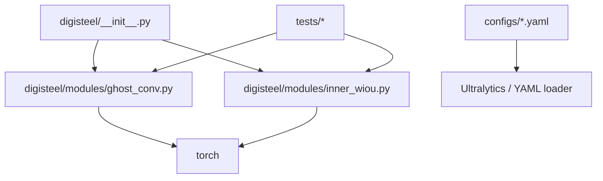

# DigiSteel-YOLO Code Wiki

This wiki documents the current repository snapshot under [/workspace](file:///workspace): how it is structured, what each major module does, the key public APIs (A2/A3 research components), and how to run what exists today.

## Quick Links

- [Architecture](Architecture.md)
- [Modules](Modules.md)
- [API Reference](API.md)
- [Dependencies](Dependencies.md)
- [Running & Development](Running.md)

## Repository Snapshot (What Exists Today)

- **Core library code:** [digisteel/](file:///workspace/digisteel)
  - Implemented: A2 GhostConv ([ghost_conv.py](file:///workspace/digisteel/modules/ghost_conv.py)), A3 Inner-WIoU loss ([inner_wiou.py](file:///workspace/digisteel/modules/inner_wiou.py))
  - Stubs/placeholders: [data/](file:///workspace/digisteel/data), [perturbations/](file:///workspace/digisteel/perturbations), [eval/](file:///workspace/digisteel/eval), [export/](file:///workspace/digisteel/export)
- **Experiment configs (dataset YAMLs):** [configs/](file:///workspace/configs)
- **Unit tests:** [tests/](file:///workspace/tests)
- **Bootstrap script:** [setup.sh](file:///workspace/setup.sh)
- **Packaging / dependencies:** [pyproject.toml](file:///workspace/pyproject.toml), [requirements.txt](file:///workspace/requirements.txt)
- **CI workflows:** [.github/workflows/](file:///workspace/.github/workflows)

## Important Reality Check (Docs vs Code)

Some root docs (notably [README.md](file:///workspace/README.md) and [QUICKSTART.md](file:///workspace/QUICKSTART.md)) describe directories such as `scripts/`, `tools/`, and `notebooks/`, but those directories are **not present** in this snapshot. The codebase currently functions as a small Python library implementing the A2/A3 components with unit tests and configuration scaffolding.

## High-Level Internal Dependency Graph

